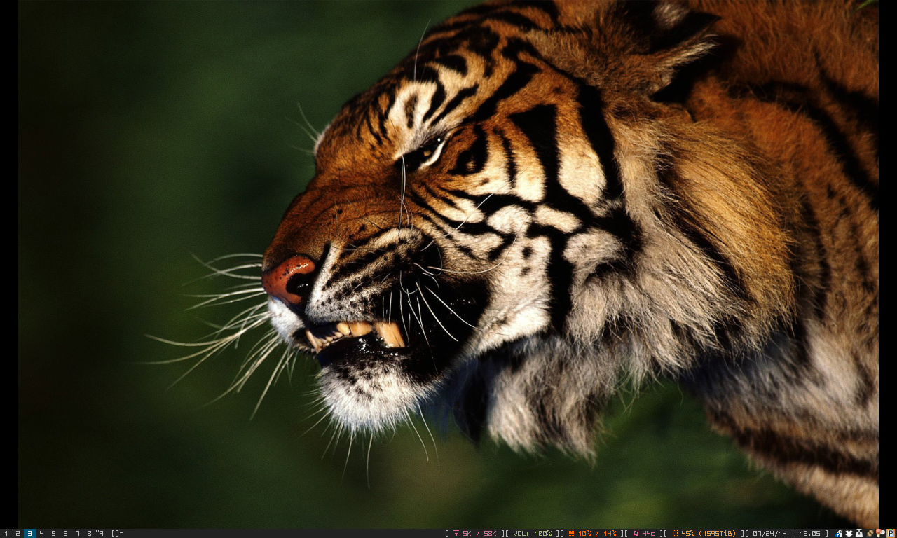

myDWM
=====

Personal Fork of DWM, It has two branches, master that is as the original dwm and has a simple status color patch, and myconfig, that as its name point, is my personal config of dwm

NOTE
====

The patch only works with dwmStatus, you can get mine here (https://github.com/algui91/myDWMstatus)

TODO
====
Fix status bar blinking when performin some actions, like focusstack

